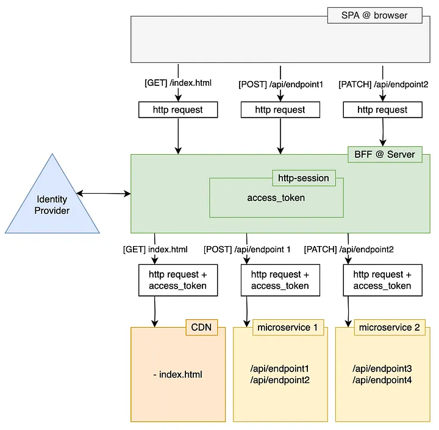

# Arcadia Platform
Introducing the Arcadia Platform. The web app that helps users view and track anime, manga, games and music. This repo contains the Next.js frontend
  
Visit Arcadia: https://arcadia-platform.vercel.app

## Latest Release - Alpha 1.1 - 4/13/2026
- **General**
    - Convert client api calls to server actions
    - Create bff layer to handle bearer authentication

## Why I Started Arcadia
See [API docs](https://github.com/Nepgyah/Arcadia-API?tab=readme-ov-file#why-i-started-arcadia) for information

## Features
Please see [Features in the Arcadia API readme](https://github.com/Nepgyah/Arcadia-API?tab=readme-ov-file#features)

## Tech
Languages: Typescript, SCSS, HTML
Frameworks: Next.js
State Management: [Zustand](https://zustand.docs.pmnd.rs/learn/getting-started/introduction)
UI: [Chakra UI](https://chakra-ui.com)
Deployment: [Vercel](https://vercel.com/home)

## Architecture
Arcadia is setup in a BFF(Backend for Frontend) architecture. In order to handle security and proper authorization, clients do not directly engage the api and instead utilize the next.js server to act on behalf of them. This allows removes the dependency of third party cookies for the client and confirms that the only connection to the backend api is the next.js server. For a visual view of this practice see below.

